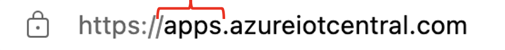
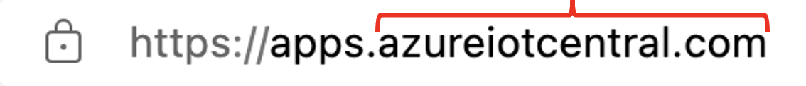
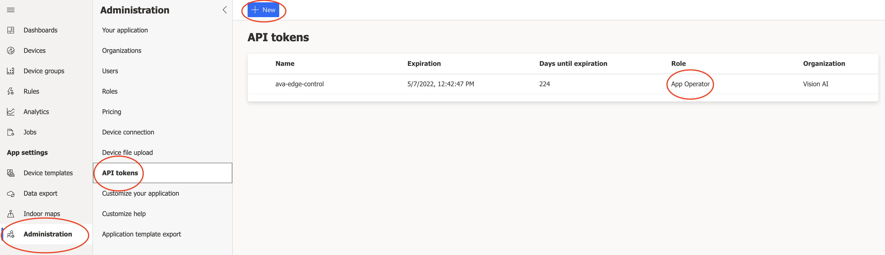
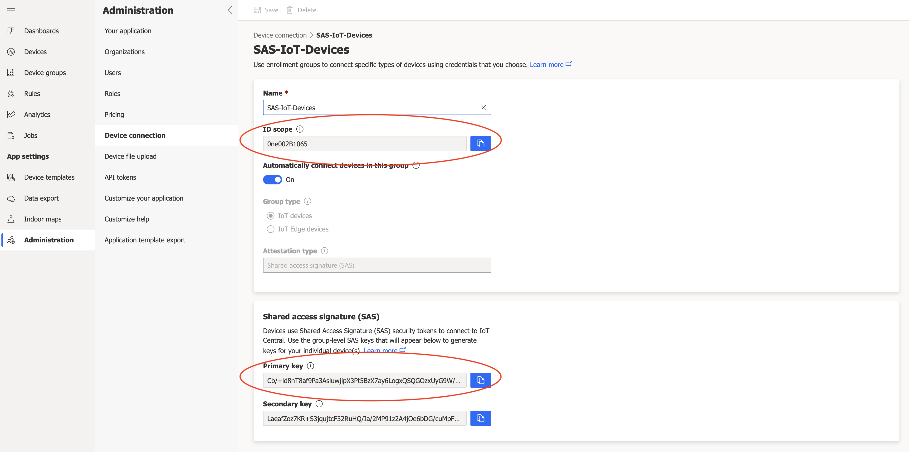
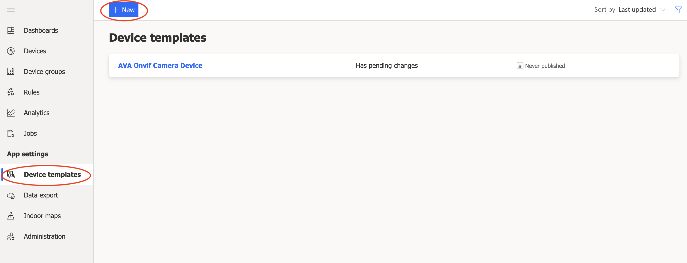
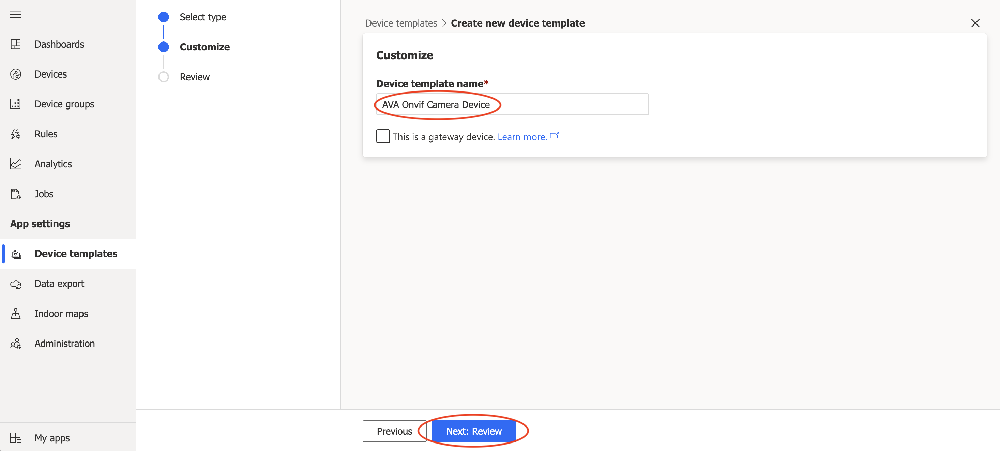
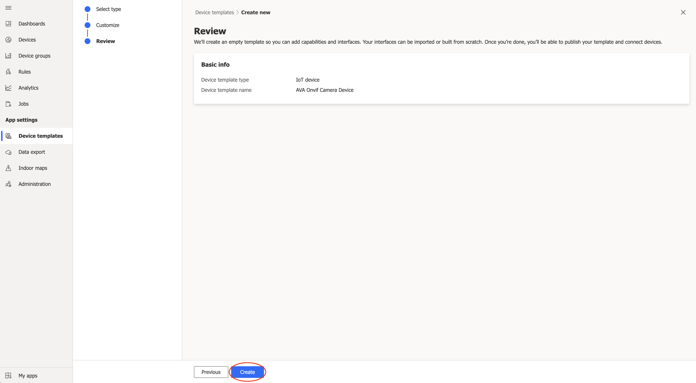
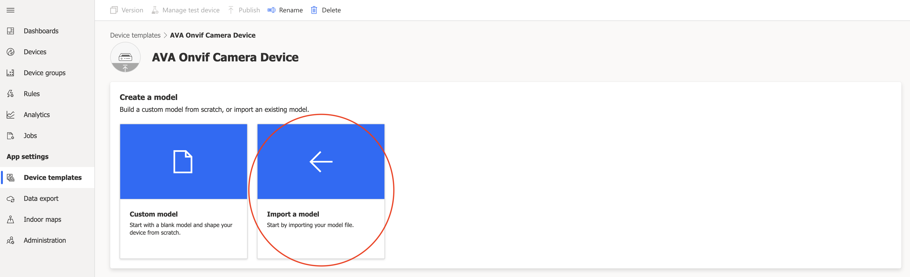
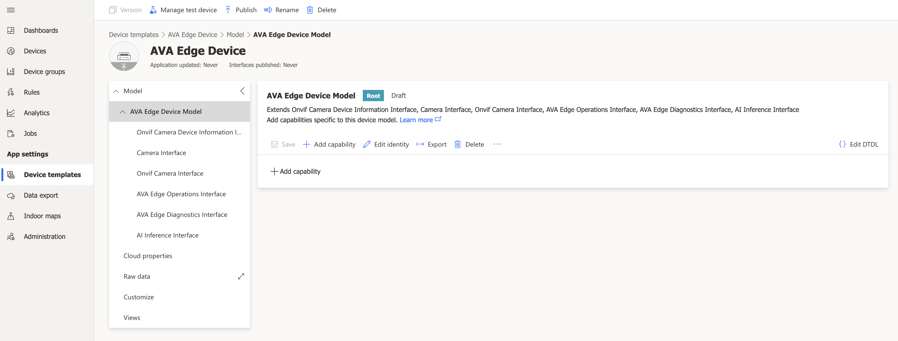

# Azure IoT Central gateway module for Azure Video Analyzer
This sample demonstrates how to use Azure IoT Central to ingest AI inferencing from intelligent video cameras managed by Azure Video Analyer on the edge. The sample includes a custom Azure IoT Edge gateway module and deployment manifest to deploy all the necessary components to create intelligent camera devices.

The full documentation for IoT Central support for Azure IoT Edge devices can be found at [Connect Azure IoT Edge devices to an Azure IoT Central application](https://docs.microsoft.com/en-us/azure/iot-central/core/concepts-iot-edge)

The full documentation for Azure Video Analyzer can be found at [What is Azure Video Analyzer?](https://docs.microsoft.com/en-us/azure/azure-video-analyzer/video-analyzer-docs/overview)

The following Azure Video Analyzer documentation can be used as a guide: [Quickstart: Analyze live video with your own model - HTTP](https://docs.microsoft.com/en-us/azure/azure-video-analyzer/video-analyzer-docs/analyze-live-video-use-your-model-http?pivots=programming-language-csharp), which shows you how to use Azure Video Analyzer to analyze the live video feed from a simulated IP camera and detect objects. The steps below will callout how to adapt IoT Central into the quickstart instead of using IoT Hub directly.

A quick note about the documentation and the differences between using IoT Hub vs. IoT Central. IoT Central is a managed application platform as a service. IoT Central is built on top of the Azure IoT platform using underlying IoT Hubs. IoT Central does not allow direct access to the underlying IoT Hub resources (e.g. via a connection string) because these are managed for you and may change based on scale, migration, fail-over, and other scenarios. Instead, devices are created via SAS keys, Certificates, or other methods using a managed instance of the [IoT Hub Device Provisioning Service](https://docs.microsoft.com/en-us/azure/iot-dps/about-iot-dps) to allow provisioning to the right IoT Hub in a scalable manner. This is all done using features provided by the IoT Central application.

Start the tutorial linked above up to the section "Set up your development environment". At this point you should have created an Azure Video Analyzer account with an associated Azure Storage Account and an Azure Virtual Machine to act as your simulated IoT edge network and device. The deployment in the tutorial also creates an Azure IoT Hub, but we will ignore that resource for the purposes of this tutorial.

## Create an Azure IoT Central Application
Next, you should create an Azure IoT Central application to use as your device management and data ingestions platform. Follow the instructions in the [Create an IoT Central application guide](https://docs.microsoft.com/en-us/azure/iot-central/core/howto-create-iot-central-application#azure-iot-central-site) to create a new IoT Central application using the custom app option. Select the appropriate plan for your needs.

## Gather in the information needed for API access to your IoT Central app
In order for the IoT Edge module to access the APIs necessary to provision and register devices in the IoT Central application we will need to gather some information. Copy these values down in a safe place for use later in the tutorial.

#### App Subdomain
When you create your IoT Central application, this is the name you give it.  


#### App Basedomain
This is the host portion of the main app url, usually azureiotcentral.com.  


#### Api Token
In your IoT Central application select Administration from the left pane, then select API tokens. You will see an option at the top of the window to create a new API token. Create a new token using the Operator role. Copy the value of the API token for use later.  


#### Device Key and Scope Id
Select Administration from the left pane, then select Device connection. Next, select the SAS-IoT-Devices link to reveal the Shared Access Signature primary key used to create device provisioning keys. Copy the Primary key and Scope id for use later.  



## Import the IoT Central device capability models for the camera device and for the gateway module
IoT Central uses capability models to describe what kind of data the devices will send (Telemetry, State, Events, and Properties) as well as what kind of commands (Direct Methods) the devices support. This gives IoT Central insight into how to support the devices and how to reason over the ingested data - e.g. rules, relationships, visualizations, and data export formats.

Select Device templates from the left pane. Select the new option to create a new template:  


Next, select the IoT Device custom template option, and then select Next: Customize at the bottom of the window:  


Name the device template, and then select Next: Review at the bottom of the window:  


Select Create:  


Now select the Import a model option:  


When asked, navigate to this repository to the `./setup/AvaEdgeOnvifCameraDeviceDcm.json` file and select open. At this point the model should be displayed with all of the interfaces describing the device's capabilities:  


## Prerequisites
* An Azure account that includes an active subscription.[Create an account for free](https://azure.microsoft.com/free/?WT.mc_id=A261C142F) if you don't already have one.
  > Note
  >
  >You will need an Azure subscription where you have access to both Contributor role, and User Access Administrator role. If you do not have the right permissions, please reach out to your account administrator to grant you those permissions.
* [Node.js](https://nodejs.org/en/download/) v14 or later
* [Visual Studio Code](https://code.visualstudio.com/Download) with [ESLint](https://marketplace.visualstudio.com/items?itemName=dbaeumer.vscode-eslint) extension installed
* [Docker](https://www.docker.com/products/docker-desktop) engine
* An [Azure Container Registry](https://docs.microsoft.com/azure/container-registry/) to host your versions of the modules

## Clone the repository and setup project
1. If you haven't already cloned the repository, use the following command to clone it to a suitable location on your local machine:
    ```
    git clone https://github.com/tbd
    ```

1. Run the install command in the cloned directory. This command installs the required packages and runs the setup scripts.
   ```
   npm install
   ```
   As part of npm install a postInstall script is run to setup your development environment. This includes  
   * Creating a `./configs` directory to store your working files. This directory is configured to be ignored by Git so as to prevent you accidentally checking in any confidential secrets.
   * The `./configs` directory will include your working files:
     * `imageConfig.json` - defines the docker container image name
     * `./mediaPipelines` - a folder containing the media pipeline files that you can edit. If you have any instance variables you would set them here in the `objectPipelineInstance.json` or the `motionPipelineInstance.json` file.
     * `./deploymentManifests` - a folder containing the Edge deployment manifest files for various cpu architectures and deployment configurations.

1. Edit the *./configs/imageConfig.json* file to update the `arch` and `imageName` for your project:
    ```
    {
        "arch": "amd64",
        "imageName": "[your_registry_server].azurecr.io/ava-edge-gateway",
        "versionTag": "1.0.0"
    }
    ```

## Edit the deployment.amd64.json file
1. In VS Code, open the the *configs/deploymentManifests/deployment.amd64.json* file.
1. Edit the `registryCredentials` section to add your Azure Container Registry credentials.

## Build the code
1. Use the VS Code terminal to run the docker login command. Use the same credentials that you provided in the deployment manifest for the modules.
    ```
    docker login [your_registry_server].azurecr.io
    ```

1. Use the VS Code terminal to run the commands to build the image and push it to your docker container registry. The build scripts deploy the image to your container registry. The output in the VS Code terminal window shows you if the build is successful.
    ```
    npm run dockerbuild
    npm run dockerpush
    ```
## Developer Notes
You can build and push debug versions of the container by passing the debug flag to the build scripts  
example: `npm run dockerbuild -- -d`

This repository is open to freely copy and uses as you see fit. It is intended to provide a reference for a developer to use as a base and which can lead to a specific solution.

## Contributing

This project welcomes contributions and suggestions. Most contributions require you to agree to a Contributor License Agreement (CLA) declaring that you have the right to, and actually do, grant us the rights to use your contribution. For details, visit [https://cla.opensource.microsoft.com](https://cla.opensource.microsoft.com).

When you submit a pull request, a CLA bot will automatically determine whether you need to provide a CLA and decorate the PR appropriately (e.g., status check, comment). Simply follow the instructions provided by the bot. You will only need to do this once across all repos using our CLA.

To find opportunities for contributions, please search for "Contributions needed" section in README.md of any folder.

## License

This repository is licensed with the [MIT license](https://github.com/Azure/live-video-analytics/blob/master/LICENSE).

## Microsoft Open Source Code of Conduct

This project has adopted the [Microsoft Open Source Code of Conduct](https://opensource.microsoft.com/codeofconduct/).

Resources:

- [Microsoft Open Source Code of Conduct](https://opensource.microsoft.com/codeofconduct/)
- [Microsoft Code of Conduct FAQ](https://opensource.microsoft.com/codeofconduct/faq/)
- Contact [opencode@microsoft.com](mailto:opencode@microsoft.com) with questions or concerns