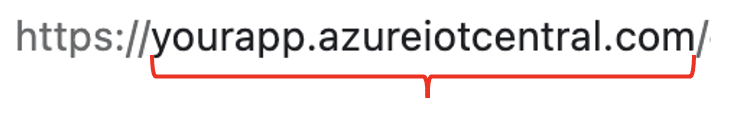
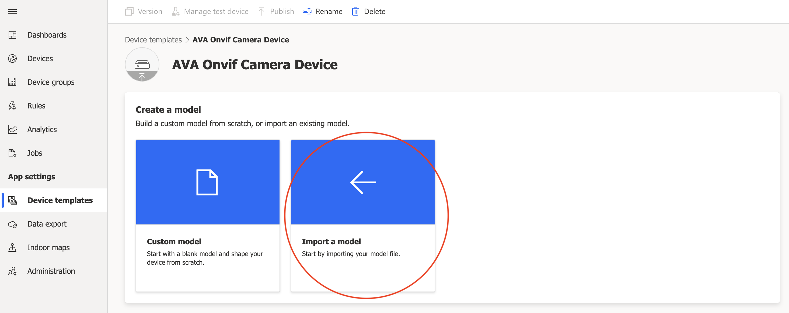
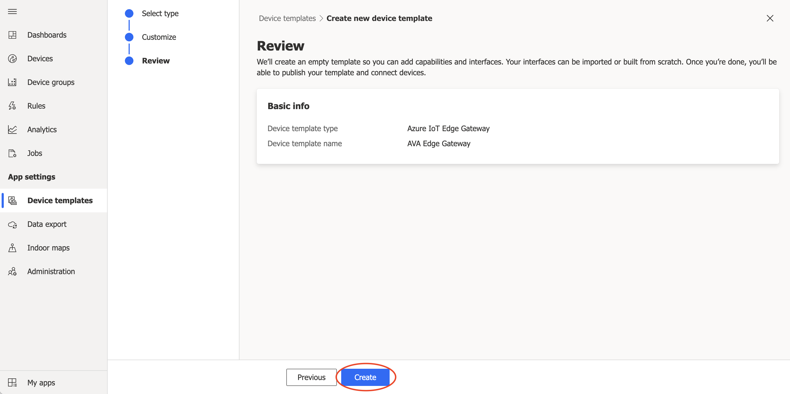
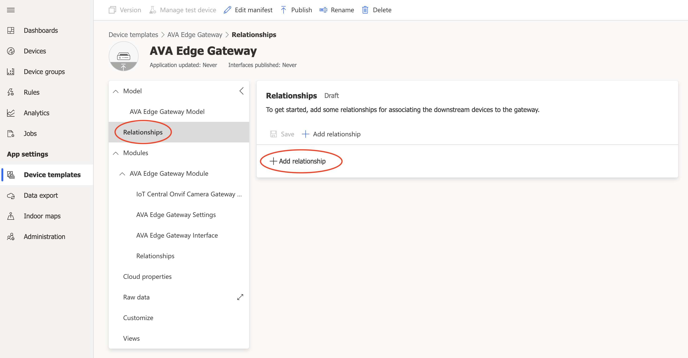
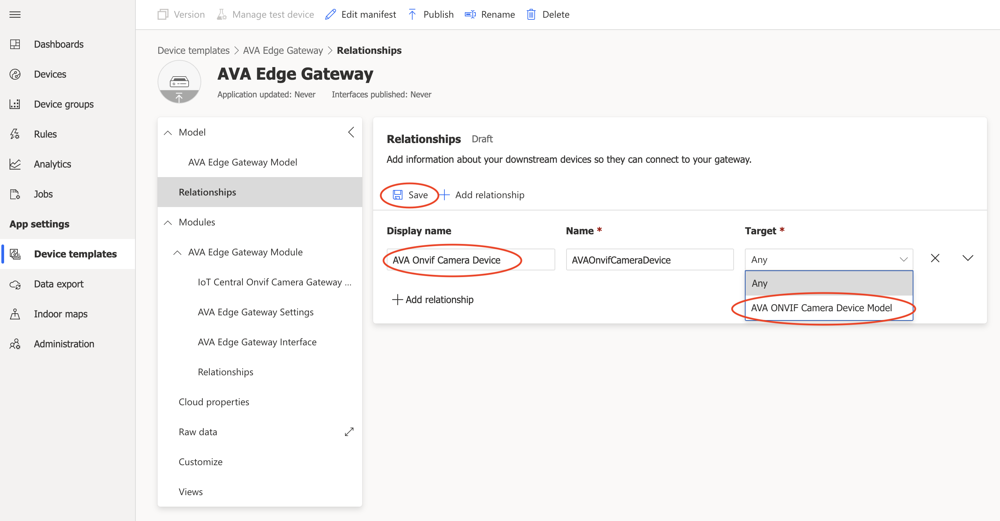
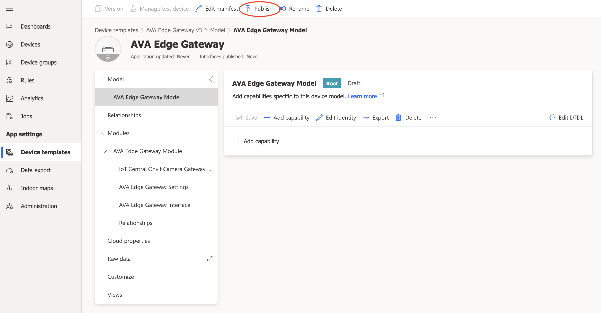
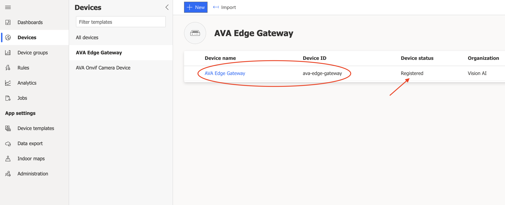

# Azure IoT Central gateway module for Azure Video Analyzer
This sample demonstrates how to use Azure IoT Central to collect AI inferencing from intelligent video cameras using the Azure Video Analyer Edge module. This sample includes a custom Azure IoT Edge gateway module for IoT Central and a deployment manifest configured to deploy all the necessary components to create intelligent camera devices using the Azure Video Analyzer Edge module.

The full documentation for IoT Central support for Azure IoT Edge devices can be found at [Connect Azure IoT Edge devices to an Azure IoT Central application](https://docs.microsoft.com/en-us/azure/iot-central/core/concepts-iot-edge)

The full documentation for Azure Video Analyzer can be found at [What is Azure Video Analyzer?](https://docs.microsoft.com/en-us/azure/azure-video-analyzer/video-analyzer-docs/overview)

The following Azure Video Analyzer documentation can be used as primer to understand how Azure Video Analyzer is configured for Azure IoT Edge deployments: [Quickstart: Analyze live video with your own model - HTTP](https://docs.microsoft.com/en-us/azure/azure-video-analyzer/video-analyzer-docs/analyze-live-video-use-your-model-http?pivots=programming-language-csharp). The documentation is specific to Azure IoT Hub deployments and will deploy extra resources that are not needed for IoT Central, just ignore the extra resources for the purposes of this guide.

A quick note about the differences between using IoT Hub vs. IoT Central. IoT Central is a managed application platform as a service. IoT Central is built on top of the Azure IoT platform using underlying IoT Hubs. IoT Central does not allow direct access to the underlying IoT Hub resources (e.g. via a connection string) because these are managed for you and may change based on scale, migration, fail-over, and other scenarios. Instead, devices are created via SAS keys, Certificates, or other methods using a managed instance of the [IoT Hub Device Provisioning Service](https://docs.microsoft.com/en-us/azure/iot-dps/about-iot-dps) (also managed by IoT Central) to allow provisioning to the right IoT Hub in a scalable manner. This is all done using features provided by the IoT Central application.

After going through the Azure Video Analyzer quickstart linked above you should have created an Azure Video Analyzer account with associated resources including Azure Storage Account, Managed Identity, IoT Hub, and an Azure Virtual Machine to act as your simulated IoT edge network and device. The steps that follow in this guide will only need the Azure Video Analyzer account, storage account, and managed identity.

## Create an Azure Video Analyzer account
You should have already done this by following the Azure Video Analyzer quickstart linked above. From the [Azure Portal](https://portal.azure.com) you should be able to access your Azure Video Analyzer account.

View your Azure Video Analyzer account now and select Edge Modules from the left pane. You should see an edge module created from the quickstart earlier, if not you can create a new one. Select Generate token on the right side of the window and copy this value in a safe place to use later in the tutorial.


## Create an Azure IoT Central Application
Next, you should create an Azure IoT Central application to use as your device management and data ingestions platform. Follow the instructions in the [Create an IoT Central application guide](https://docs.microsoft.com/en-us/azure/iot-central/core/howto-create-iot-central-application#azure-iot-central-site) to create a new IoT Central application using the Custom app option. Select the appropriate plan for your needs.

### Gather in the information needed for API access to your IoT Central app
In order for the IoT Edge module to access the APIs necessary to provision and register devices in the IoT Central application we will need to gather some information. Copy these values down in a safe place for use later in the tutorial.

#### App Host Uri
When you create your IoT Central application you will specify a name. The name combined with the base uri will be your App Host Uri. Copy this value.  
##### Example:


#### Api Token
In your IoT Central application select Administration from the left pane, then select API tokens. You will see an option at the top of the window to create a new API token. Create a new token using the Operator role. Copy the value of the API token for use later.  


#### Device Key and Scope Id
Select Administration from the left pane, then select Device connection. Next, select the SAS-IoT-Devices link to reveal the enrollment group Shared access signature Primary key used to create device provisioning keys. Copy the Primary key and Scope id for use later.  


### Import the IoT Central device capability models for the camera device and for the gateway module
IoT Central uses capability models to describe what kind of data the devices will send (Telemetry, State, Events, and Properties) as well as what kind of commands (Direct Methods) the devices support. This gives IoT Central insight into how to support the devices and how to reason over the ingested data - e.g. rules, relationships, visualizations, and data export formats.

#### Import the Device Model
Select Device templates from the left pane. Select the new option to create a new template:  


Next, select the IoT Device custom template option, and then select Next: Customize at the bottom of the window:  


Name the device template, and then select Next: Review at the bottom of the window:  


Select Create:  


Now select the Import a model option:  


When asked, navigate in your repository to the `./setup/deviceCapabilityModels/AvaOnvifCameraDeviceDcm.json` file and select open. At this point the model should be displayed with all of the interfaces describing the device's capabilities. Now publish the model by selecting the publish option at the top of the window:  


#### Import the Edge Gateway Model
We will use the same steps to import the gateway model. One extra step will be to associate the device model with the gateway. This establishes the relationship between the gateway module that we will deploy and the leaf devices (downstream devices) that it will create.

Select Device templates from the left pane. Select the new option to create a new template:  


Next, select the Azure IoT Edge custom template option, and then select Next: Customize at the bottom of the window:  


Name the edge template. And this time also check the gateway option. Be sure not to select the Browse option. Then select Next: Review at the bottom of the window:  


Select Create:  


Now select the Import a model option:  


When asked, navigate in your repository to the `./setup/deviceCapabilityModels/AvaEdgeGatewayDcm.json` file and select open. At this point the model should be displayed with all of the interfaces describing the gateway device's capabilities:  


Now we need to add a relationship between the gateway and leaf devices that it creates (the leaf devices are represented by the previous AvaOnvifCameraDevice model we imported). Select the top-level Relationship item under the Model in the left pane, then select Add relationship on the right:  


Name the device relationship and select the device model that we published in the previous steps and then save it:  


Now we are almost ready to publish this template, but first we have need to add an edge deployment manifest to our edge gateway model.

### Create the Edge Deployment Manifest
 * In your cloned project repository folder you should have a `./configs` sub-folder which contains editable copies of the contents of the `./setup` folder. For this guide we will use the deployment manifest located at `./configs/deploymentManifests/deployment.quickstart.amd64.json`. The only value we should need to add to this file is the Azure Video Analytics account Edge Module access token that you saved earlier in this guide. Copy that value to the deployment manifest:  
 
 * Back in your IoT Central application select edit manifest from where we left off at the AVA Edge Gateway template screen:  
 
 * Select the replace it with a new file option and open deployment template you just edited:  
 
 * You should see your manifest displayed, including the change to include the Azure Video Analyzer Edge module access token. If everything looks good, select the Save option:  
 
 * Select the Publish option to publish the completed gateway model template:  
 

 At this point you have completed the steps define a gateway edge device template in IoT Central that includes an IoT Edge deployment manifest. This deployment manifest defines which modules the IoT Edge runtime should download onto the edge device, including where to get the modules and how the modules route messages between them and ultimately up to the cloud IoT Hub instance managed inside IoT Central.

 The next step will be to create an IoT Edge device that is configured to register itself with our IoT Central application. Once that is done, the deployment manifest will begin downloading the modules to the edge device and the entire solution will begin operating.

## Create an IoT Edge Device
The full documentation describing how to install Azure IoT Edge on a device can be found at [Install or uninstall Azure IoT Edge for Linux](https://docs.microsoft.com/en-us/azure/iot-edge/how-to-install-iot-edge?view=iotedge-2020-11). This documentation is specific to the Linux operating system but the Azure IoT Edge documentation online has instructions for other operating systems as well as the caveats regarding version and feature support on each operating system. For the purposes of this guide we will assume an AMD64/x64 device running the Linux Ubuntu version 20.x operating system. See the specific [instructions on how to install the Ubuntu operation system](https://ubuntu.com/tutorials/install-ubuntu-desktop#1-overview) on hardware that you would like to use as your Azure IoT Edge device.

> NOTE: In the Azure Video Analytics quickstart linked at the beginning of this guide you created an Azure VM with the Azure IoT Edge runtime installed on it. Feel free to use that Virtual Machine resource; however, you will need to first [upgrade the Azure IoT Edge runtime to version 1.2](https://docs.microsoft.com/en-us/azure/iot-edge/how-to-update-iot-edge?view=iotedge-2020-11&tabs=linux).

### In your IoT Central app create a new gateway device
Select Devices in the left pane, then select the AVA Edge Gateway model to the right, then select New at the top of the window:  


Give the new device a name and device id, then select the Create button at the bottom of the window:  


By creating a new device using the AVA Edge Gateway model this device instance will take on all of the capability of the model definition, including specifically the edge deployment manifest that we included earlier. You should see the new device in your device list:  


Notice that the Device statis is currently set to **Registered**. This means that the device is configured in the cloud. Specifically, it is registered in the Device enrollment group for edge devices managed by IoT Central. This scenario is what is called "cloud first provisioning".

Select the gateway device to view its details screen, then select the Connect option at the top of the window:  


This will display the device connection information. We will need to gather three pieces of information to use to provision the IoT Edge device as this cloud created device:  
  1. ID scope (to be used as id_scope in the IoT Edge configuration)
  1. Device ID (to be used as registration_id in the IoT Edge configuration)
  1. Primary key (to be used as symmetric_key in the IoT Edge configuration)

Copy these values to be used in the next section:  


### Provision the IoT Edge device with its cloud identity
In the instructions to install Azure IoT Edge above go to the section [Option 1: Authenticate with symmetric keys](https://docs.microsoft.com/en-us/azure/iot-edge/how-to-install-iot-edge?view=iotedge-2020-11#option-1-authenticate-with-symmetric-keys). The instructions there ask you to update the **Manual provisioning with connection string** section in the `config.toml` file. Instead we will edit the **DPS provisioning with symmetric key** section. Uncomment that section so it looks like this:
```
## DPS provisioning with symmetric key
[provisioning]
source = "dps"
global_endpoint = "https://global.azure-devices-provisioning.net/"
id_scope = "0ab1234C5D6"

[provisioning.attestation]
method = "symmetric_key"
registration_id = "my-device"

symmetric_key = { value = "YXppb3QtaWRlbnRpdHktc2VydmljZXxhemlvdC1pZGVudGl0eS1zZXJ2aWNlfGF6aW90LWlkZW50aXR5LXNlcg==" } # inline key (base64), or...
# symmetric_key = { uri = "file:///var/secrets/device-id.key" }                                                          # file URI, or...
# symmetric_key = { uri = "pkcs11:slot-id=0;object=device%20id?pin-value=1234" }                                         # PKCS#11 URI
```
Update the configuration information with the values you copied above. Continue with the instructions in the IoT Edge Documentation to apply your changes and verify successful configuration.

After successfully configuring your IoT Edge device it will use the configuration to provision IoT Edge device as the device we created in IoT Central (e.g. ava-edge-gateway). To verify this you should notice that the device status in IoT Central changes from Registered to Provisioned:  


## Prerequisites
* An Azure account that includes an active subscription.[Create an account for free](https://azure.microsoft.com/free/?WT.mc_id=A261C142F) if you don't already have one.
  > Note
  >
  >You will need an Azure subscription where you have access to both Contributor role, and User Access Administrator role. If you do not have the right permissions, please reach out to your account administrator to grant you those permissions.
* [Node.js](https://nodejs.org/en/download/) v14 or later
* [Visual Studio Code](https://code.visualstudio.com/Download) with [ESLint](https://marketplace.visualstudio.com/items?itemName=dbaeumer.vscode-eslint) extension installed
* [Docker](https://www.docker.com/products/docker-desktop) engine
* An [Azure Container Registry](https://docs.microsoft.com/azure/container-registry/) to host your versions of the modules

## Clone the repository and setup project
1. If you haven't already cloned the repository, use the following command to clone it to a suitable location on your local machine:
    ```
    git clone https://github.com/tbd
    ```

1. Run the install command in the cloned local folder. This command installs the required packages and runs the setup scripts.
   ```
   npm install
   ```
   As part of npm install a postInstall script is run to setup your development environment. This includes  
   * Creating a `./configs` folder to store your working files. This folder is configured to be ignored by Git so as to prevent you accidentally checking in any confidential secrets.
   * The `./configs` folder will include your working files:
     * `imageConfig.json` - defines the docker container image name
     * `./mediaPipelines` - a folder containing the media pipeline files that you can edit. If you have any instance variables you would set them here in the `objectPipelineInstance.json` or the `motionPipelineInstance.json` file.
     * `./deploymentManifests` - a folder containing the Edge deployment manifest files for various cpu architectures and deployment configurations.

1. Edit the *./configs/imageConfig.json* file to update the `arch` and `imageName` for your project:
    ```
    {
        "arch": "amd64",
        "imageName": "[your_registry_server].azurecr.io/ava-edge-gateway",
        "versionTag": "1.0.0"
    }
    ```

## Edit the deployment.amd64.json file
1. In VS Code, open the the *configs/deploymentManifests/deployment.amd64.json* file.
1. Edit the `registryCredentials` section to add your Azure Container Registry credentials.

## Build the code
1. Use the VS Code terminal to run the docker login command. Use the same credentials that you provided in the deployment manifest for the modules.
    ```
    docker login [your_registry_server].azurecr.io
    ```

1. Use the VS Code terminal to run the commands to build the image and push it to your docker container registry. The build scripts deploy the image to your container registry. The output in the VS Code terminal window shows you if the build is successful.
    ```
    npm run dockerbuild
    npm run dockerpush
    ```
## Developer Notes
You can build and push debug versions of the container by passing the debug flag to the build scripts  
##### Example:
```
npm run dockerbuild -- -d
```

This repository is open to freely copy and uses as you see fit. It is intended to provide a reference for a developer to use as a base and which can lead to a specific solution.

## Contributing

This project welcomes contributions and suggestions. Most contributions require you to agree to a Contributor License Agreement (CLA) declaring that you have the right to, and actually do, grant us the rights to use your contribution. For details, visit [https://cla.opensource.microsoft.com](https://cla.opensource.microsoft.com).

When you submit a pull request, a CLA bot will automatically determine whether you need to provide a CLA and decorate the PR appropriately (e.g., status check, comment). Simply follow the instructions provided by the bot. You will only need to do this once across all repos using our CLA.

To find opportunities for contributions, please search for "Contributions needed" section in README.md of any folder.

## License

This repository is licensed with the [MIT license](https://github.com/Azure/live-video-analytics/blob/master/LICENSE).

## Microsoft Open Source Code of Conduct

This project has adopted the [Microsoft Open Source Code of Conduct](https://opensource.microsoft.com/codeofconduct/).

Resources:

- [Microsoft Open Source Code of Conduct](https://opensource.microsoft.com/codeofconduct/)
- [Microsoft Code of Conduct FAQ](https://opensource.microsoft.com/codeofconduct/faq/)
- Contact [opencode@microsoft.com](mailto:opencode@microsoft.com) with questions or concerns