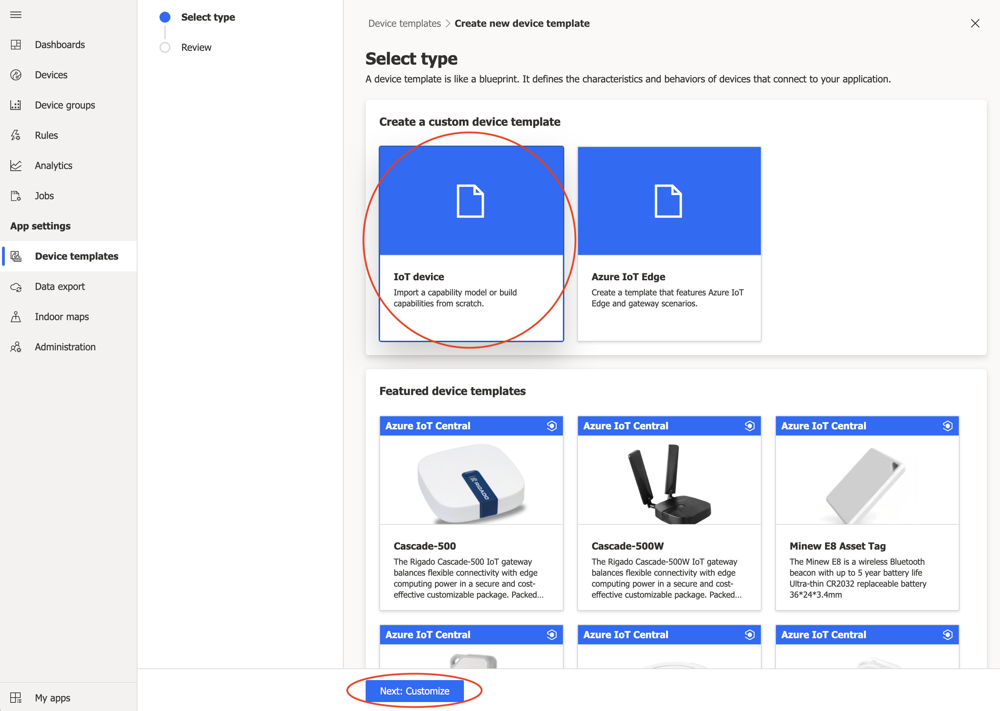
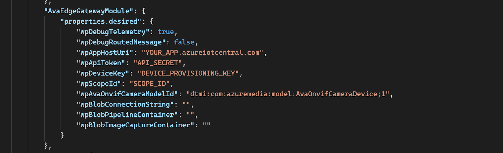
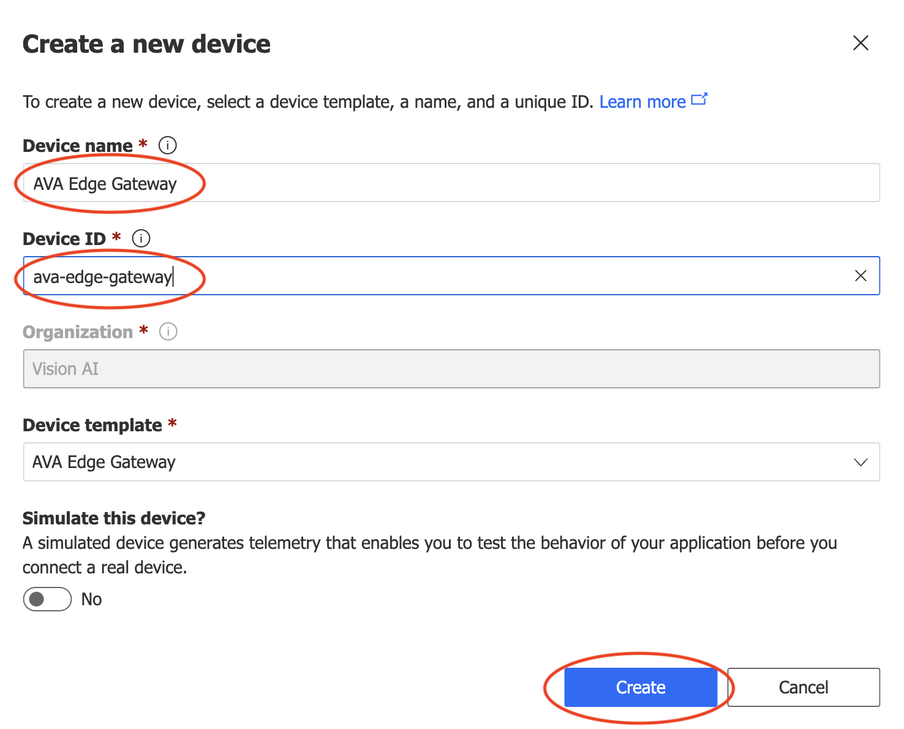
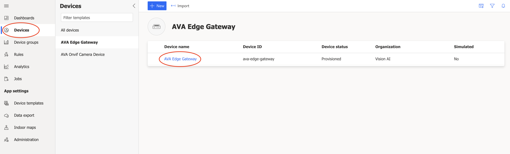

# NOTICE OF DEPRECATION:
This video analytics sample depends on the Azure Video Analyzer (preview) service which is now officially retired. The Azure Video Analyzer retirement notice can be viewed here:  
https://azure.microsoft.com/en-us/updates/video-analyzer-retirement/

This does not imply that any features of IoT Central are being retired or deprecated in any way. This only applies to the video analyzer edge component and features which are demonstrated in this sample.

Azure Video Analyzer transition options are offered and documented here:  
https://docs.microsoft.com/en-us/azure/azure-video-analyzer/video-analyzer-docs/transition-from-video-analyzer

## The code in this sample documented below can be used during the deprecation period but will no longer work after the Azure Video Analyzer retirement date.
<br/><br/>

# Azure IoT Central gateway module for Azure Video Analyzer
This sample demonstrates how to use Azure IoT Central to collect AI inferencing from intelligent video cameras using the Azure Video Analyer Edge module. This sample includes a custom Azure IoT Edge gateway module for IoT Central and a deployment manifest configured to deploy all the necessary components to create intelligent camera devices using the Azure Video Analyzer Edge module.


The full documentation for IoT Central support for Azure IoT Edge devices can be found at [Connect Azure IoT Edge devices to an Azure IoT Central application](https://docs.microsoft.com/en-us/azure/iot-central/core/concepts-iot-edge)

The full documentation for Azure Video Analyzer can be found at [What is Azure Video Analyzer?](https://docs.microsoft.com/en-us/azure/azure-video-analyzer/video-analyzer-docs/overview)

The following Azure Video Analyzer documentation can be used as primer to understand how Azure Video Analyzer is configured for Azure IoT Edge deployments: [Quickstart: Analyze live video with your own model - gRPC](https://docs.microsoft.com/en-us/azure/azure-video-analyzer/video-analyzer-docs/edge/analyze-live-video-use-your-model-grpc?pivots=programming-language-csharp). The documentation is specific to Azure IoT Hub deployments but covers the main video analyzer concepts.

A quick note about the differences between using IoT Hub vs. IoT Central. IoT Central is a managed application platform as a service. IoT Central is built on top of the Azure IoT platform using underlying IoT Hubs. IoT Central does not allow direct access to the underlying IoT Hub resources (e.g. via a connection string) because these are managed for you and may change based on scale, migration, fail-over, and other scenarios. Instead, devices are created via SAS keys, Certificates, or other methods using a managed instance of the [IoT Hub Device Provisioning Service](https://docs.microsoft.com/en-us/azure/iot-dps/about-iot-dps) (also managed by IoT Central) to allow provisioning to the right IoT Hub in a scalable manner. This is all done using features provided by the IoT Central application.

After going through the Azure Video Analyzer quickstart linked above you should have created an Azure Video Analyzer account with associated resources including an Azure Storage Account, Managed Identity, IoT Hub, and an Azure Virtual Machine to act as your simulated IoT edge network and device. The steps that follow in this guide will only use the Azure Video Analyzer account.

## Create an Azure Video Analyzer account


You should have already done this by following the Azure Video Analyzer quickstart linked above. From the [Azure Portal](https://portal.azure.com) you should be able to access your Azure Video Analyzer account.

View your Azure Video Analyzer account now and select Edge Modules from the left pane. You should see an edge module created from the quickstart earlier, if not you can create a new one. Select *Generate token* on the right side of the window and copy this value in a safe place to use later in the tutorial.


## Create an Azure IoT Central Application


Next, you should create an Azure IoT Central application to use as your device management and data ingestions platform. Follow the instructions in the [Create an IoT Central application guide](https://docs.microsoft.com/en-us/azure/iot-central/core/howto-create-iot-central-application#azure-iot-central-site) to create a new IoT Central application using the Custom app option. Select the appropriate plan for your needs.

### Import the IoT Central device capability models for the camera device and for the gateway module
IoT Central uses capability models to describe what kind of data the devices will send (Telemetry, State, Events, and Properties) as well as what kind of commands (Direct Methods) the devices support. This gives IoT Central insight into how to support the devices and how to reason over the ingested data - e.g. rules, relationships, visualizations, and data export formats.

#### Import the Device Model


Select *Device templates* from the left pane. Select the *new* option to create a new template:  


Next, select the *IoT Device* custom template option, and then select *Next: Customize* at the bottom of the window:  


Name the device template, and then select *Next: Review* at the bottom of the window:  


Select *Create*:  


Now select the *Import a model* option:  


When asked, navigate in your repository to the `./setup/deviceCapabilityModels/AvaOnvifCameraDeviceDcm.json` file and select open. At this point the model should be displayed with all of the interfaces describing the device's capabilities. Now publish the model by selecting the *publish* option at the top of the window:  


#### Import the Edge Gateway Model


We will use the same steps to import the gateway model. One extra step will be to associate the device model with the gateway. This establishes the relationship between the gateway module that we will deploy and the leaf devices (downstream devices) that it will create.

Select *Device templates* from the left pane. Select the *new* option to create a new template:  


Next, select the *Azure IoT Edge* custom template option, and then select *Next: Customize* at the bottom of the window:  


Name the edge template. And this time also check the *This is a gateway device* option. 
> Note: Be sure not to select the *Browse* option.  

Then select *Next: Review* at the bottom of the window:  


Select *Create*:  


Now select the *Import a model* option:  


When asked, navigate in your repository to the `./setup/deviceCapabilityModels/AvaEdgeGatewayDcm.json` file and select open. At this point the model should be displayed with all of the interfaces describing the gateway device's capabilities:  


Now we need to add a relationship between the gateway and leaf devices that it creates (the leaf devices are represented by the previous AvaOnvifCameraDevice model we imported). Select the top-level *Relationship* item under the Model in the left pane, then select *Add relationship* on the right:  


Name the device relationship and select the device model that we published in the previous steps and then select the *save* button:  


Now we are almost ready to publish this template, but first we have need to add an edge deployment manifest to our edge gateway model.

### Create the Edge Deployment Manifest


 * In your cloned project repository folder you should have a `./configs` sub-folder which contains editable copies of the contents of the `./setup` folder. For this guide we will use the deployment manifest located at `./configs/deploymentManifests/deployment.quickstart.amd64.json`.

> Note: You will need to build your own docker container for this module before this manifest can be used. See the **Custom Development** section at the end of this README document for instructions showing how to build this module. After your docker container is pushed to your container registry you will need to specify it in the `deployment.quickstart.amd64.json` file in the AvaEdgeGatewayModule section's `image:` property.
 
Open a second browser window to your IoT Central application to gather the values below. For the AvaEdgeGatewayModule module we will collect these properties:


 * **wpAppHostUri**  
   When you create your IoT Central application you will specify a name. The name combined with the base uri will be your App Host Uri. You can find this value in the *Administration* settings from the left pane. Copy this full url to the **wpAppHostUri** property in your deployment manifest:  
   

 * **wpApiToken**  
   Also in the *Administration* settings from the left pane, select *API tokens*. You will see an option at the top of the window to create a new API token. Create a new token using the Operator role. Copy the generated api token to the **wpApiToken** property in your deployment manifest:  
   

 * **wpDeviceKey** and **wpScopeId**  
   Finally select *Device connection* from the *Administration* settings. Next, select the *SAS-IoT-Devices* link to reveal the enrollment group Shared access signature Primary key used to create device provisioning keys. Copy these values to the **wpDeviceKey** and **wpScopeId** properties in your deployment manifest:  
   
   

 * **wpAvaOnvifCameraModelId**  
   This value should already be set with the default camera device capability model id for this sample. Use a different value if necessary if you are customizing this sample.  

 For the avaEdge module the only value you need to add to this file is the Azure Video Analytics account Edge Module access token that you saved earlier in this guide. Update the deployment manifest with your Edge Module access token:  
   

 * Back in your IoT Central application select *edit manifest* from where we left off at the AVA Edge Gateway template screen:  
   
 
 * Select the **replace it with a new file** option and open deployment template you just edited:  
   

 * You should see your manifest displayed, including the change to include the Azure Video Analyzer Edge module access token. If everything looks good, select the *Save* option at the bottom of the window:  
   

 * Select the *Publish* option to publish the completed gateway model template:  
 

 At this point you have completed the steps to define a gateway edge device template in IoT Central that includes an IoT Edge deployment manifest. This deployment manifest defines which modules the IoT Edge runtime should download onto the edge device, including where to get the modules and how the modules route messages between them and ultimately up to the cloud IoT Hub instance managed inside IoT Central.

 The next steps will be to create a registration in IoT Central for an IoT Edge device instance using this template and then finally configure the real IoT Edge device hardware with the credentials so that it can provision itself as our new device. Once that is done, the deployment manifest will be downloaded into the edge device and the IoT Edge runtime will begin downloading the specified modules to the edge device and the entire solution will begin operating.

### Create an IoT Edge Device


First, you will need to setup and configure some hardware to be your IoT Edge device. The full documentation describing how to install Azure IoT Edge on a device can be found at [Install or uninstall Azure IoT Edge for Linux](https://docs.microsoft.com/en-us/azure/iot-edge/how-to-install-iot-edge?view=iotedge-2020-11). This documentation is specific to the Linux operating system but the Azure IoT Edge documentation online has instructions for other operating systems as well as the caveats regarding version and feature support on each operating system. For the purposes of this guide we will assume an AMD64/x64 device running the Linux Ubuntu operating system (18.x or 20.x). See the specific [instructions on how to install the Ubuntu operation system](https://ubuntu.com/tutorials/install-ubuntu-desktop#1-overview) on hardware that you would like to use as your Azure IoT Edge device.

> NOTE: If you would like to create a simulated IoT Edge environment follow these steps using the Azure CLI to create a virtual machine provisioned with IoT Edge runtime version 1.2. You will need your Azure subsription id, a resource group name, a prefix to use for the DNS names of the Azure resources that will be created, and a password.

  ```
  az login
  
  az account set -s <subscriptionid>
  
  az group create -l <region e.g. 'eastus'> -n <resourcegroupname>

  az deployment group create \
    --resource-group <resourcegroupname> \
    --template-uri "https://raw.githubusercontent.com/Azure/iotedge-vm-deploy/1.2.0/edgeDeploy.json" \
    --parameters dnsLabelPrefix='<nameprefix>' \
    --parameters deviceConnectionString='' \
    --parameters authenticationType='password' \
    --parameters adminUsername='avaadmin' \
    --parameters adminPasswordOrKey='<yourpassword>'
  ```

### In your IoT Central app create a new gateway device
Next, you will need to create a device registration for your IoT Edge device. Select *Devices* in the left pane, then select the AVA Edge Gateway model to the right, then select *New* at the top of the window:  


Give the new device a name and device id, then select the *Create* button at the bottom of the window:  


By creating a new device registration using the AVA Edge Gateway model this device instance will take on all of the capability of the model definition, including specifically the edge deployment manifest that we included earlier. You should see the new device in your device list. Notice that the Device status is currently set to **Registered**. This means that the device is configured in the cloud. Specifically, it is registered in the Device Provisioning Service managed by IoT Central using the enrollment group for edge devices. This scenario is what is called "cloud first provisioning".

Select the gateway device to view its details screen


Next, select the Connect option at the top of the window:  


This will display the device connection information. We will need to gather three pieces of information to use in the IoT Edge device configuration file:  
  1. ID scope (to be used as id_scope in the IoT Edge configuration)
  1. Device ID (to be used as registration_id in the IoT Edge configuration)
  1. Primary key (to be used as symmetric_key in the IoT Edge configuration)

Copy these values to be used in the next section:  


### Provision the IoT Edge device with its cloud identity


This sample will be using DPS provisioning with symmetric keys for the IoT Edge device registration. Instructions can be found here: [Create and provision IoT Edge devices at scale on Linux using symmetric key](https://docs.microsoft.com/en-us/azure/iot-edge/how-to-provision-devices-at-scale-linux-symmetric?view=iotedge-2020-11&tabs=individual-enrollment#provision-the-device-with-its-cloud-identity). The instructions there ask you to edit the **DPS provisioning with symmetric key** section.

Follow the instructons and update the configuration file with the values you copied above. Continue with the instructions in the IoT Edge Documentation to apply your changes and verify successful configuration.

After successfully configuring your IoT Edge device it will use the configuration to provision IoT Edge device as the device we created in IoT Central (e.g. ava-edge-gateway). To verify this you should notice that the device status in IoT Central changes from Registered to Provisioned:  


IoT Edge solutions require a fair amount of configuration and depending on your network environment, hardware, or configuration you can encounter issues. Be sure to use the following guides for diagnosing common issues with Azure IoT Edge:
 * [Troubleshoot your IoT Edge device](https://docs.microsoft.com/en-us/azure/iot-edge/troubleshoot?view=iotedge-2020-11)
 * [Common issues and resolutions for Azure IoT Edge](https://docs.microsoft.com/en-us/azure/iot-edge/troubleshoot-common-errors?view=iotedge-2020-11)

## Test the solution with a real camera
### Create a Camera Device
Select the ava-edge-gateway device that you created:


Next, select the *Commands* tab and scroll to the *Add Camera* command. Fill out the *Add Camera* command parameters. If you have a camera that supports the ONVIF protocol select True and skip the Camera Device Information parameters - these parameters will be automatically read using the ONVIF protocol.

If your camera is a plain RTSP camera select False and provide the RTSP Video Stream value as well as the additional (simulated) parameters for Camera Device Information. If you are using the simulated camera module `rtspsim` from this sample, the *RTSP Video Stream* value will be `rtsp://rtspsim:554/media/camera-300s.mkv`  


Select the *Run* button at the bottom of the window when you are finished.

> Note: while testing the gateway module it is good practice to monitor the logging output of the module. Keep another command window open with an ssh connection to your IoT Edge device. View the conainter logs with the Docker command:
> ```
> docker logs -f --tail 200 AvaEdgeGatewayModule
> ```

If the command succeeded you should see the camera device you just created in the Device list in IoT Central:  


Now, select that device select the *Commands* tab to see the supported commands defined by this device model:


Scroll down to the *Start AVA Processing* command. That command requires the name of a Pipeline and a Live configuration for the Video Analytics module to apply to the camera stream. These parameters refer to files which can be either stored on an Azure Storage account (blob storage container) or they can be read directly from the storage on the Azure IoT Edge device. The IoT Central gateway module is pre-built to include a set of sample pipeline files. One of those pipeline sets is `objectDetectionYoloV3GrpcExt-Pipeline` and `objectDetectionYoloV3GrpcExt-Live`.

Enter these values for the Start AVA Processing command:


Assuming the camera you specified when you created the camera device was property configured with either a valid local network IP Address, ONVIF username and ONVIF password in the case of an ONVIF supported camera, or a valid RTSP camera stream with username and password in the case of a non-ONVIF camera, the Azure Video Analytics Edge module should begin processing the video stream from the camera.
 
To verify that video processing is happening you can view the log files on the IoT Edge device, or you can view the Raw Data telemetry values that are being ingested and processed in your IoT Central application. To view the Raw Data input from your camera device select the camera device in IoT Central, then select the Raw Data tab:  


## Custom Development
This sample is intended to provide a reference for a developer to use as a basis which can lead to a specific solution. Follow the instructions below to build your own version of this sample.

### Prerequisites
* An Azure account that includes an active subscription.[Create an account for free](https://azure.microsoft.com/free/?WT.mc_id=A261C142F) if you don't already have one.
  > Note
  >
  >You will need an Azure subscription where you have access to both Contributor role, and User Access Administrator role. If you do not have the right permissions, please reach out to your account administrator to grant you those permissions.
* [Node.js](https://nodejs.org/en/download/) v14 or later
* [Visual Studio Code](https://code.visualstudio.com/Download) with [ESLint](https://marketplace.visualstudio.com/items?itemName=dbaeumer.vscode-eslint) extension installed
* [Docker](https://www.docker.com/products/docker-desktop) engine
* An [Azure Container Registry](https://docs.microsoft.com/azure/container-registry/) to host your versions of the built Docker containers. You can also use another container registry like DockerHub.

### Clone the repository and setup project
1. If you haven't already cloned the repository, use the following command to clone it to a suitable location on your local machine:
    ```
    git clone <this sample repository>
    ```

1. Run the install command in the cloned local folder. This command installs the required packages and runs the setup scripts.
   ```
   npm install
   ```
   As part of npm install a postInstall script is run to setup your development environment. This includes  
   * Creating a `./configs` folder to store your working files. This folder is configured to be ignored by Git so as to prevent you accidentally checking in any confidential secrets.
   * The `./configs` folder will include your working files:
     * `./deploymentManifests` - a folder containing the sample Edge deployment manifest files.
     * `./mediaPipelines` - a folder containing the media pipeline files that you can edit. If you have any instance variables you would set them in the files in this folder.
     * `imageConfig.json` - defines the docker container image and tag to use when building the Docker container


1. Edit the *./configs/imageConfig.json* file to update the `arch` and `imageName` for your project:
    ```
    {
        "arch": "amd64",
        "imageName": "[your_registry_server].azurecr.io/ava-edge-gateway",
        "versionTag": "1.0.0"
    }
    ```

### Edit the deployment.amd64.json file
1. In VS Code, open the the *configs/deploymentManifests/deployment.amd64.json* file.
1. Edit the `registryCredentials` section to add your Azure Container Registry and credentials.

### Build the code
1. Use the VS Code terminal to run the docker login command so the docker push script can access your container registry. Use the same credentials that you provided in the deployment manifest for the modules. Remember, this can also be your own DockerHub container registry.
    ```
    docker login [your_registry_server].azurecr.io
    ```

1. Use the VS Code terminal to run the commands to build the image and push it to your docker container registry. The build scripts deploy the image to your container registry. The output in the VS Code terminal window shows you if the build is successful.
    ```
    npm run dockerbuild
    npm run dockerpush
    ```
### Developer Notes
You can build and push debug versions of the container by passing the debug flag to the build scripts  
#### Example:
```
npm run dockerbuild -- -d
npm run dockerpush -- -d
```

You can build and push using custom imageConfig files by passing the configFile flag to the build scripts  
#### Example:
```
npm run dockerbuild -- -d -c imageConfig-dev.json
npm run dockerpush -- -d -c imageConfig-dev.json
```

#### Debug remote IoT Edge containers
The `.vscode` directory contains a `iotcentral-gateway remote` debugging configuration. If you build using the `-d` debug flag it will use the <arch>-debug Dockerfile to build the image. This Dockerfile starts the container with the `--inspect=0.0.0.0:9229` NodeJS debugger on a specific port. Using this image you can remotely debug your container using Visual Studio Code.  

More information here:
https://code.visualstudio.com/docs/containers/debug-common

## Contributing

This project welcomes contributions and suggestions. Most contributions require you to agree to a Contributor License Agreement (CLA) declaring that you have the right to, and actually do, grant us the rights to use your contribution. For details, visit [https://cla.opensource.microsoft.com](https://cla.opensource.microsoft.com).

When you submit a pull request, a CLA bot will automatically determine whether you need to provide a CLA and decorate the PR appropriately (e.g., status check, comment). Simply follow the instructions provided by the bot. You will only need to do this once across all repos using our CLA.

To find opportunities for contributions, please search for "Contributions needed" section in README.md of any folder.

## License

This repository is licensed with the [MIT license](https://github.com/Azure/live-video-analytics/blob/master/LICENSE).

## Microsoft Open Source Code of Conduct

This project has adopted the [Microsoft Open Source Code of Conduct](https://opensource.microsoft.com/codeofconduct/).

Resources:

- [Microsoft Open Source Code of Conduct](https://opensource.microsoft.com/codeofconduct/)
- [Microsoft Code of Conduct FAQ](https://opensource.microsoft.com/codeofconduct/faq/)
- Contact [opencode@microsoft.com](mailto:opencode@microsoft.com) with questions or concerns
